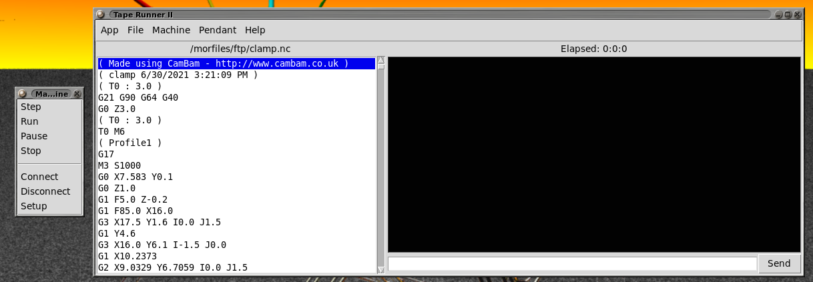

# TapeRunner
Python 3 program for spooling NC files to grbl. 

Depencies:
  python3-serial

Running:
  python3 main.py

Using:
** You need permision to the serial port, I just use   chmod 777 /dev/ttyS0  (or whatever)
The menus are tear-off, I suggest tearing off the machine menu.
click Machine -> Setup
Select your communication port, the program does its best to list ports for you, but you can type in whatever port name you want.
Select your baud rate. default is 9600 because faster is not better.

click Machine -> Connect
Depending on your setup, grbl might automatically send you a hello message
You can type a ? into the lower command box and click send (or push enter) and grbl should tell you its status.

click File -> open and open up an NC file (if you want)

You can edit the file at any time (even while the program is running)
The blue hilighted line is the one that it will next send to the machine, if taperunner is not in 'run' mode, 
it will follow whatever line you click on. You can use this with machine->step to send particular lines in whatever order you want.

Have fun and don't you dare tell me about any bugs!

